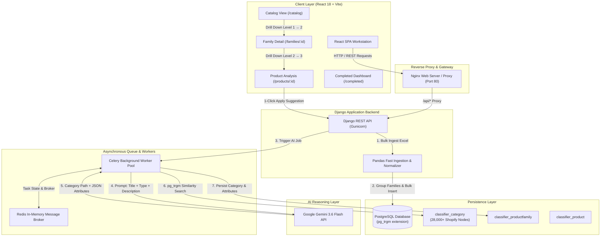

# 🛒 Shopify Product AI Taxonomy Classifier & 3-Level Drill-Down Dashboard

An enterprise-grade, full-stack e-commerce automation workstation designed to ingest massive product catalogs (10,000+ items), normalize product variations into parent families, autonomously classify them into official **Shopify Standard Product Taxonomy** categories using **Google Gemini 3.6 Flash AI**, and provide a 3-level interactive drill-down web workstation for human inspection, attribute extraction, and manual review.

---

## 🏗️ Full-System Architecture & System Flow



---

### Architectural Layer Breakdown

#### 1. Client Layer (React 18 + Vite)
- **Role**: High-performance Single Page Application (SPA) built with React 18, Vite, and custom Glassmorphism CSS.
- **Workflow**: Serves the 3-level interactive drill-down workstation (`ProductCatalog` → `FamilyDetail` → `ProductAnalysis`), live processing dashboard, and CSV exporter.

#### 2. Reverse Proxy Layer (Nginx)
- **Role**: Containerized Nginx reverse proxy running on Port `80`.
- **Workflow**: Routes incoming browser traffic between frontend static assets and Django REST API backends, eliminating CORS issues and handling proxy buffering.

#### 3. Application Server Layer (Django 5.0 + Gunicorn)
- **Role**: Robust Python application server handling API authentication, Pandas excel file parsing, database transactions, and task dispatching.
- **Engine**: Ingests 10,000+ product rows in seconds using Pandas, normalizes variant titles into parent families, and bulk inserts them into PostgreSQL via `bulk_create`.

#### 4. Asynchronous Queue Layer (Celery + Redis)
- **Role**: Decoupled asynchronous worker infrastructure.
- **Workflow**: Manages background queue execution, concurrency limits, API rate limiting, and exponential backoff retry strategies (`429` rate limit & `503` service overload recovery).

#### 5. AI Reasoning Engine (Google Gemini 3.6 Flash Engine - Multimodal)
- **Role**: Generative AI model powered by `gemini-3.6-flash`.
- **Workflow**: Receives a single multimodal payload containing the product's visual image (fetched directly from variant image URL via Pillow/Requests) alongside text metadata (`title`, `product_type`, `brand`, `description`); returns predicted Shopify category path and extracted JSON attributes in a single pass.

#### 6. Persistence & Similarity Search Layer (PostgreSQL `pg_trgm`)
- **Role**: Primary database populated with 28,000+ official Shopify Product Taxonomy categories.
- **Workflow**: Employs trigram matching (`similarity(name, %s)`) to match Gemini AI predictions against exact database category IDs (`fr-XX`), eliminating hallucinations and generating ranked alternative candidate suggestions.

---

## 🌟 Key Architecture & Highlights

### ⚡ 1. Pandas On-Demand Aggregation & Fast Ingestion
- **Bulk Excel Ingestion**: Ingests massive Excel/CSV files containing thousands of unclassified SKUs in seconds using Python `pandas` and Django `bulk_create`.
- **Product Family Grouping**: Automatically normalizes titles (e.g. removing variant suffixes like `- Black`, `- Set of 2`, `- 86"`) to aggregate SKUs into single **Product Families**. This prevents duplicate AI calls for identical item variations and cuts API token costs by over 80%.

---

### 🧠 2. Two-Stage Gemini AI & PostgreSQL `pg_trgm` Matching
- **Structured AI Classification & Attribute Extraction**: Calls Google's `gemini-3.6-flash` model to predict the official Shopify category hierarchy while simultaneously extracting structured product attributes in JSON format:
  ```json
  {
    "brand": "Modway",
    "material": "Acacia Wood",
    "shape": "Round",
    "size": "86\"",
    "set_includes": "Table and Bench"
  }
  ```
- **PostgreSQL `pg_trgm` Trigonometric Fuzzy Matching**: Converts AI predictions into exact foreign-key references against 28,000+ official Shopify taxonomy database nodes using PostgreSQL `similarity(name, %s)` queries, guaranteeing strict adherence without AI hallucinations.
- **Alternative Suggestions Generator**: Calculates top candidate category matches with confidence scoring (≥90% auto-completed, <90% sent to manual review).

---

### 🔬 3. Interactive 3-Level Drill-Down UI Workstation
Designed for e-commerce catalog managers to inspect items from 10,000 feet down to exact AI reasoning:

1. **Level 1 — Product Family Catalog (`/catalog`)**:
   - Overview table displaying grouped families, representative 64×64 thumbnails, brand names, status badges (`Completed`, `Pending`, `Processing`, `Review Needed`), and AI category paths.
   - Search by title or brand, filter by status, and trigger on-demand single-click AI analysis.
2. **Level 2 — Family Details Page (`/families/:familyId`)**:
   - Deep-dive into a specific product family showing the complete variant count, AI extracted attribute badges (`Material`, `Shape`, `Brand`), and a full list of child SKUs/variations with individual thumbnails.
3. **Level 3 — Product AI Analysis Page (`/products/:productId`)**:
   - High-res product view, full product description text, and exact AI taxonomy prediction breakdown.
   - **1-Click AI Category Suggestions**: Interactive suggestion chips (`+ Apply`) allowing manual reviewers to attach alternative category suggestions with a single click.
   - Custom category override search box for manual classification.

---

### 📊 4. Real-Time Completed Items Dashboard (`/completed`)
- Grid view of all classified families with category paths and confidence scores.
- **CSV Export**: One-click download exporting all categorized items to `.csv` for direct import into Shopify.

---

## 🧬 Attribute Extraction Engine Implementation

The attribute extraction system is engineered to extract structured e-commerce attributes (e.g. `material`, `shape`, `size`, `set_includes`, `brand`, `style`) directly from raw, unformatted product title and description text.

### 1. Prompt Design for Dual Extraction (`tasks.py`)
Rather than making separate API calls for classification and attribute extraction, a single optimized prompt instructs **Gemini 3.6 Flash** to return both the taxonomy path and key-value JSON attributes in one pass:

```text
You are an e-commerce product classifier.
Given the product below, output the best Shopify taxonomy category path using this format:
  Category: <Top Level> > <Sub Category> > <Leaf Category>
Then extract key attributes as compact JSON.

Product: Viva Round Acacia Wood Side Table by Modway
Type: Living Room
Brand: Modway

Respond ONLY in this format (no extra text):
Category: ...
Attributes: {"material": "...", "style": "..."}
```

### 2. Regex & Dynamic JSON Parsing
The worker task extracts the structured JSON response using regular expressions and safely loads it into Python data structures:

```python
cat_match = re.search(r'Category:\s*(.+)', text, re.IGNORECASE)
attr_match = re.search(r'Attributes:\s*(\{.*?\})', text, re.DOTALL | re.IGNORECASE)

attributes = {}
if attr_match:
    try:
        attributes = json.loads(attr_match.group(1))
    except Exception:
        pass
```

### 3. PostgreSQL JSONField Storage (`models.py`)
To handle variable attributes across diverse product types (e.g., furniture needs `material` & `shape`, whereas apparel needs `sleeve_length` & `fabric`), attributes are stored in a schema-agnostic `JSONField`:

```python
class ProductFamily(models.Model):
    ...
    extracted_attributes = models.JSONField(blank=True, null=True)
```

### 4. Frontend Attribute Rendering (`ProductAnalysis.jsx` & `FamilyDetail.jsx`)
Extracted key-value pairs are rendered dynamically in the UI:
- **Family View**: Badge pills displaying key attributes (e.g., `Material: Acacia Wood`, `Shape: Round`, `Brand: Modway`).
- **Product AI Analysis View**: A dedicated attribute grid breaking down all extracted fields.

---

## 🛠️ Technology Stack

### **Backend Infrastructure**
- **Framework**: Python 3.11 / Django 5.0 / Django REST Framework
- **Task Queue & Broker**: Celery + Redis for async background AI workers
- **Database**: PostgreSQL with `pg_trgm` extension for trigonometric similarity search
- **AI Engine**: Google Gemini API (`gemini-3.6-flash`)
- **Reverse Proxy / Container**: Nginx + Docker & Docker Compose

### **Frontend Client**
- **Framework**: React 18 + Vite
- **Routing**: React Router DOM (v6)
- **HTTP Client**: Axios (configured with REST API interceptors)
- **UI/Styling**: Vanilla CSS Design System (Glassmorphism, Dark Mode Palette, Micro-animations)
- **Icons**: React Icons (`fi`)

---

## 🔌 API Endpoints Summary

| Method | Endpoint | Description |
|---|---|---|
| `POST` | `/api/products/import/` | Upload Excel file & run Pandas family aggregation |
| `GET` | `/api/families/` | Paginated list of product families (with search & status filters) |
| `GET` | `/api/families/<id>/` | Single family detail + all associated child product variants |
| `POST` | `/api/families/<id>/analyze/` | Trigger Gemini AI classification & attribute extraction for a family |
| `GET` | `/api/products/<id>/detail/` | Detailed product analysis view + family AI classification data |
| `PATCH` | `/api/products/<id>/` | Manually assign or update a family category path |
| `GET` | `/api/products/stats/` | Live analytics counters (Pending, Processing, Completed, Review) |
| `POST` | `/api/products/pause/` | Pause background AI task processing in Redis |
| `POST` | `/api/products/resume/` | Resume background AI task processing in Redis |

---

## 🚀 Quick Start & Local Setup

### 1. Prerequisites
- Docker & Docker Compose installed
- Node.js v18+ (for frontend)
- Google Gemini API Key

---

### 2. Backend Installation (Docker)

1. **Configure Environment Variables**:
   Create a `.env` file in the root directory:
   ```env
   GEMINI_API_KEY=your_gemini_api_key_here
   POSTGRES_DB=shopify_db
   POSTGRES_USER=postgres
   POSTGRES_PASSWORD=postgres
   POSTGRES_HOST=db
   POSTGRES_PORT=5432
   ```

2. **Boot Infrastructure Services**:
   ```bash
   docker compose up -d --build
   ```

3. **Run Database Migrations & Enable `pg_trgm`**:
   ```bash
   docker compose exec web python manage.py migrate
   ```

4. **Seed Shopify Taxonomy Data**:
   ```bash
   docker compose exec web python manage.py seed_categories
   ```
   *(Backend API will be live at `http://localhost/api/`)*

---

### 3. Frontend Installation (React + Vite)

1. Navigate to the frontend folder:
   ```bash
   cd shopify_product_frontent/frontend
   ```

2. Install dependencies:
   ```bash
   npm install
   ```

3. Start Vite dev server:
   ```bash
   npm run dev
   ```
   *(Frontend dashboard will be live at `http://localhost:5173/`)*

---

## 🧪 Testing Business Logic

To execute automated unit and integration tests for Pandas family grouping and PostgreSQL fuzzy matching:

```bash
docker compose exec web python test.py
```

---

## 📄 License
Distributed under the MIT License. See `LICENSE` for more details.
